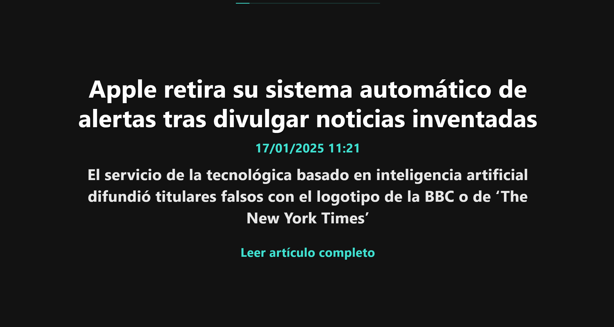

# ANLOVI - Accessible News for LOw Vsion Individuals



*Visualización general de la página que muestra una noticia*

Este es un sistema de uso personal diseñado específicamente para personas con baja visión, que muestra noticias de El País en un formato accesible y adaptado que ocupa toda la pantalla, con un tamaño de letra considerable y viisble por cualquier persona sin hacer mucho esfuerzo.

## Justificación

Esta aplicación surge de la necesidad actual del propio programador por ver de un vistazo las noticias y subtitulos de las mismas, sin mayor distracciones e informándose rapidamente de las nuevas noticias.

Al pensar en esta aproximación se pensó que la funcionalidad de un sistema como el comentado en el anterior párrafo, si se planeabla con la letra más grande, a parte de ser un sistema para visionar noticias rapidamente, podría ayudar a personas con baja visión.

Muchas personas con baja visión, pese a tener gafas para visión de cerca, leer contenidos con letras pequeñas les resulta un problema, pueden hacerlo, pero forzando la vista, lo cual hace que se les canse más rapidamente.

Tanto las webs convencionales como periódicos no contienen material adaptado, y si lo tienen son solo descriptores de pantalla mediante voz, lo cual es cómodo, pero no siempre funcional para personas con este tipo de craracterísticas concretas.


## 🎯 Características Principales

- **Diseño de Alto Contraste**: Interfaz oscura con texto claro para maximizar la legibilidad
- **Texto Grande**: Titulares y descripciones en tamaño adaptativo según el dispositivo
- **Navegación Simplificada**: Uso de flechas del teclado para moverse entre noticias
- **Resúmenes Concisos**: Descripción breve debajo de cada titular para mejor contexto
- **Interfaz Minimalista**: Diseño limpio sin distracciones visuales
- **Responsive**: Se adapta a cualquier tamaño de pantalla
- **Noticias Actualizadas**: Solo se muestran noticias del día actual y como máximo del día anterior para garantizar información actualizada

## 🚀 Uso

1. Las noticias se muestran una a la vez en pantalla completa
2. Usar las flechas del teclado para navegar:
   - `→` o `↓`: Siguiente noticia
   - `←` o `↑`: Noticia anterior o volver al inicio
3. El subtítulo de la noticia se muestra para un mayor contexto
4. Las noticias se actualizan automáticamente cada 5 minutos
5. En la parte superior de la pantall, se muestra una barra de proceso.


## 🛠 Tecnologías

- **Frontend**: HTML5, CSS3, JavaScript
- **Backend**: Python con Flask
- **Fuente de Datos**: RSS Feed de El País
- **Características clave de accesibilidad**:
  * Pantalla extendida de noticias
  * Orden cronológico de noticias
  * Diseño responsivo
  * Actualizaciones dinámicas de contenido
  * Navegación bidireccional de noticias
- **Mejoras de navegación**:
  * Navegación con flechas bidireccional
  * Funcionalidad para volver a la página inicial
  * Optimizado para usuarios con baja visión


## ⚙️ Requisitos Técnicos

- Python 3.8+
- Flask
- Feedparser
- python-dotenv
- gunicorn (para producción)

## 📝 Configuración

1. Clonar el repositorio:
   ```bash
   git clone <url-del-repositorio>
   cd noticias-accesibles
   ```

2. Crear un entorno virtual e instalar dependencias:
   ```bash
   python -m venv venv
   source venv/bin/activate  # En Windows: venv\Scripts\activate
   pip install flask feedparser python-dotenv gunicorn
   ```

3. Configurar variables de entorno:
   - Crear un archivo `.env` en la raíz del proyecto y configurar las siguientes variables:
   ```
   FLASK_APP=main.py
   FLASK_ENV=development
   SECRET_KEY=your-secret-key-here
   NEWS_API_KEY=your-news-api-key-here
   NEWS_FEED_URL=https://feeds.elpais.com/mrss-s/pages/ep/site/elpais.com/portada
   ```
   **IMPORTANTE**: Antes de ejecutar la aplicación, asegúrate de revisar y configurar todas las claves necesarias en el archivo `.env`. La aplicación no funcionará correctamente sin estas configuraciones.

4. Ejecutar la aplicación:
   ```bash
   python main.py
   ```

5. Abrir en el navegador: `http://localhost:5000`

## 🎨 Personalización

El diseño está optimizado para baja visión con:
- Fondo oscuro para reducir el cansancio visual
- Texto grande y en negrita para mejor legibilidad
- Espaciado aumentado entre letras y líneas
- Alto contraste en todos los elementos

## 📄 Licencia y Autoría

© 2025 Eduardo J. Barrios. Todos los derechos reservados.

Este proyecto está protegido por derechos de autor. Para utilizar, reproducir o distribuir este contenido:

- **Autor**: Eduardo J. Barrios (@edujbarrios)
- **Email**: eduardojbarriosgarcia@gmail.com
- **Website**: https://edujbarrios.com

**Términos de Uso**:
1. Es necesario contactar al autor original para obtener permiso de uso
2. Se debe mencionar y acreditar al autor original en cualquier uso o reproducción
3. No se permite el uso comercial sin autorización expresa
4. La modificación y distribución requieren autorización previa

## ⚠️ Nota

Este proyecto utiliza el feed RSS público de El País como fuente de noticias. El contenido mostrado pertenece a sus respectivos propietarios.


## Fechas dde las noticias

Las noticias que se muestran, son solo del mismo día y de las horas finales del día anterior, para evitar desinformación y desactualización de las noticias.


## ToDo's:

- Emplear react native para realizar una APP con Android e iOS con la misma funcionalidad. Cualquier contribución es bienvenida. 


